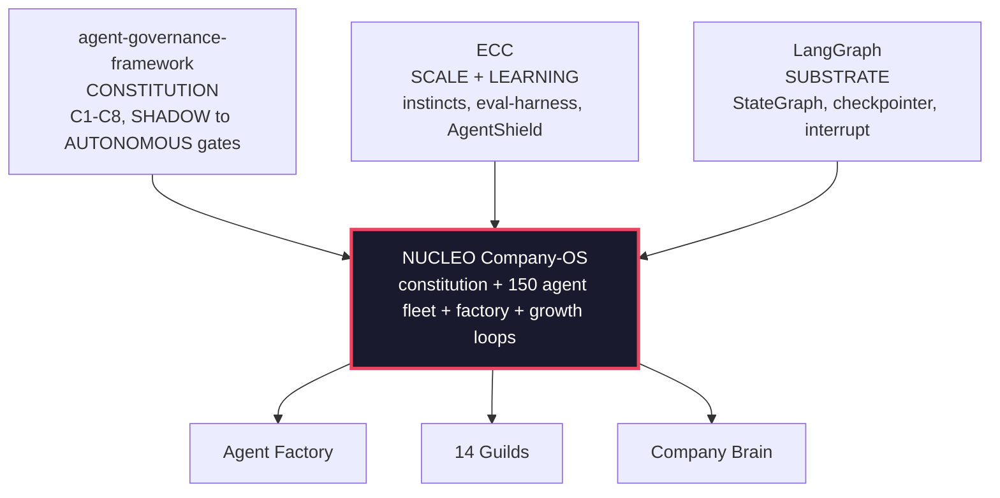

# Multi-Agent Company OS (codename NÚCLEO)

> Read this in [Portuguese](README.pt-BR.md).

> **What it is:** a reference framework for running an entire company as a fleet of agents, ~169 agents across 14 guilds (sales, marketing, finance, support, engineering, data, security), on top of **LangGraph**, with an executable constitution (C1 to C8) and promotion gates across four modes: **SHADOW → PILOT → ASSISTED → AUTONOMOUS**. Every agent starts in observation mode (it suggests, it does not act) and only earns autonomy by proving agreement on auditable gates.
>
> **Context:** the business scenario in the documents (the "Orbita Labs" venture, its ICP and GTM) is **fictional**, used as a coherent example to exercise the framework. No real company, person or customer is referenced.
>
> **Status:** working prototype (kernel + factory + pilot guilds + offline demos), v1, 2026-05-29.

---

## The central engineering finding: never let a system grade its own homework

The most important result in this repository is not the fleet. It is the measurement that **self-evaluation lies at scale**:

- The internal evaluator (`run_evals`, with cases generated by the same pipeline that generates the agents) approved **~100%** of the fleet.
- An **independent external LLM judge** (a different model family from the generator) approved **33%** of the same agents (N=24).
- Root cause, visible in the artifact cache: agents were producing **prose-in-JSON that *describes* the capability instead of the real artifact or code**, and the eval cases, authored by the same process, were **tautological** (`expected` was a replay of the handler itself; in one episode 270 out of 270 cases passed that way, with every gate green).

The fix became the **verification architecture** of the framework. Structural independence, not discipline:

| Mechanism | What it closes | Where |
|---|---|---|
| **Mandatory provenance** on every eval case (`catalog` / `human` / `independent`; `replay` forbidden) | `expected` as an echo of the handler | [AGENTS.md](AGENTS.md) §0.4, `nucleo/quality/pre_pr_gate.py` |
| **Held-out oracle** (VERIFY-IN-EVAL): a criterion the agent never sees; the verdict is a function of the artifact (ast/diff/sha), never a self-declared boolean | an agent authoring its own proof | `nucleo/kernel/verification.py`, `tests/test_verify_*` |
| **External judge from a different model family**, with an internal-vs-external correlation report in CI | inflated internal gate | `nucleo/quality/judge_eval.py`, `.github/workflows/judge-correlation.yml` |
| **Anti-tautology red team**: a deliberately vulnerable agent MUST fail the suite | decorative security tests | `nucleo/quality/` + `tests/test_redteam.py` |
| **Diff homogeneity detector** (cloned case blocks) plus a **baseline that only shrinks** | gaming the metric with clone cases | `nucleo/quality/diff_homogeneity.py`, `foundry_baseline.json` |
| **Author/auditor separation**: whoever generates the agent never generates its tests; the auditor never authors and never merges | the same actor attesting its own delivery | [AGENTS.md](AGENTS.md) §0.5, [docs/CONTRATO-NUCLEO-HERMES-ORACULO.md](docs/CONTRATO-NUCLEO-HERMES-ORACULO.md) |

> Full episode write-up and the decisions that followed: [FABRICA-DE-AGENTES.md](FABRICA-DE-AGENTES.md) and [docs/PLANO-AJUSTE-ROTA.md](docs/PLANO-AJUSTE-ROTA.md).

---

## The thesis in one sentence

> We did not hand-build 150 agents. We built a **Company OS** (codename **NÚCLEO**) that **manufactures, governs and evolves** a fleet of 150+ agents, fusing the governable constitution of the [agent-governance-framework](https://github.com/rafaelnovaes22/agent-governance-framework) (C1 to C8, promotion gates, unit economics, self-harness) with scale and learning patterns (instincts, eval harness, multi-agent orchestration), executed on the **LangGraph** runtime (stateful graphs, checkpointing, human-in-the-loop).

---

## Documents in this plan

Document bodies are written in Portuguese; this README is the English entry point.

| # | Document | Contents |
|---|---|---|
| 00 | **README.md** (this file) | Thesis, key decisions, tension resolution, roadmap summary |
| 01 | [01-AVALIACAO.md](01-AVALIACAO.md) | Assessment of the agent-governance-framework (strengths and gaps) and how the two frameworks merge |
| 02 | [02-ARQUITETURA.md](02-ARQUITETURA.md) | NÚCLEO layers, LangGraph topology, economic model, telemetry, evolution loop |
| 03 | [03-CATALOGO-AGENTES.md](03-CATALOGO-AGENTES.md) | The 14 guilds, the ~169 agents, and the anatomy (template) of each agent |
| 04 | [04-IMPLEMENTACAO.md](04-IMPLEMENTACAO.md) | LangGraph code skeletons (agent, supervisor, self-harness, gate), phased roadmap to MVP, risks and mitigations |
| 05 | [05-DOUTRINA-GTM-LOVABLE.md](05-DOUTRINA-GTM-LOVABLE.md) | Growth and culture doctrine, growth constitution GR1 to GR10, operating cadence, north star |
| 06 | [06-WORKSHOP-MERCADO.md](06-WORKSHOP-MERCADO.md) | Facilitator-ready workshop to pick the vertical: pre-work run by the agents themselves, decision matrix, Market Decision Record |
| 📂 | [catalogo/](catalogo/) | **Agent-by-agent detail**, one file per guild (G00 to G14), plus the [handoff map](catalogo/00-MAPA-E-HANDOFFS.md) |
| 📂 | [workshop/](workshop/) | Market workshop kit: seed long list of candidates and the data-pack template |
| 🚀 | [DECK-CEO.md](DECK-CEO.md) · [nucleo/](nucleo/) | CEO deck and **Sprint 0 running**: kernel, factory, 6 agents, 8 demos |

---

## The 7 architecture decisions

1. **NÚCLEO governs, LangGraph executes, the Factory manufactures.** The agent-governance-framework is build-time (Markdown, Claude Code). For 150 *live* agents we ported the constitution to a **LangGraph runtime** and built an **Agent Factory** that materializes each agent from a spec. Nobody writes 150 agents by hand.

2. **Agents are born in SHADOW and evolve by earning autonomy.** The C4 cycle (`SHADOW → PILOT → ASSISTED → AUTONOMOUS`) *is* the evolution mechanism: an agent only earns autonomy (and the right to deliver and to bill) by proving agreement and quality at gates. Learning means moving up in trust.

3. **The fleet is organized into hierarchical guilds.** Each guild is a hierarchical LangGraph team (supervisor agent plus worker agents), which removes human middleware and gives a credible path to 150+ agents without chaos.

4. **Every action emits an artifact into the Company Brain.** An append-only event store plus a graph and vector index make the company **queryable**. Dashboards, audits and the learning loop all read from it.

5. **Learning runs at two speeds.** Fast and automatic: instincts auto-extracted per session with a confidence score. Slow and curated: self-harness snapshots turned into memory PRs. `/evolve` promotes recurring instincts to **shared skills**, which is how the whole company gets smarter instead of a single agent.

6. **Two economic ledgers resolve the "token-max vs. cost cap" tension.** See below.

7. **Humans sit only at DRI, IC and founder nodes.** The human layer is thin and fixed; agents do the routing. Human approval gates are implemented as LangGraph `interrupt()` calls at the C4 checkpoints.

---

## The central tension: token-max vs. cost at or below 25% of price

One doctrine says to run an uncomfortably high API bill to replace headcount. The framework constitution says operating cost must stay at or below 25% of the price charged (C3, a hard gate). These look contradictory. They are not, because they operate on **different ledgers**:

| Ledger | What it is | Governance rule | Correct comparison |
|---|---|---|---|
| **OPERATING (internal)** | Agents doing the company's own work (engineering, ops, growth, internal support) | **Token-max**, run it hot | Token cost **vs. loaded cost of the headcount it replaces**. A high bill is a win if the human would cost 10x. |
| **BILLABLE (external)** | Agents whose output is **sold** to an end customer | **C3**, cost at or below 25% of price | Inference cost per outcome **vs. price per outcome** |

> **Root rule:** every agent declares its ledger in its spec (`ledger: operating | billable`). The Unit Economist (the C3 guard) only blocks promotion for `billable` agents. `operating` agents are governed by ROI vs. headcount, not by C3. This preserves both doctrines without contradiction.

---

## Roadmap summary

| Phase | Window | Delivery | Fleet | Mode |
|---|---|---|---|---|
| **0, Kernel** | Weeks 0 to 2 | Runtime constitution, Company Brain, agent template, self-harness wrapper, root supervisor, telemetry, the Factory | ~5 | build |
| **1, Agents that make agents** | Weeks 2 to 5 | Governance, Engineering, Quality and Security guilds (the Factory goes from human to agentic) | ~35 | SHADOW |
| **2, Mass manufacturing** | Weeks 5 to 9 | The Factory materializes business guilds (Product, Growth, Sales, CustOps, Finance, Data) from specs | **150+** | SHADOW/PILOT |
| **3, MVP** | Weeks 9 to 12 | Critical-path agents promoted to ASSISTED/AUTONOMOUS through gates, eval harness, economic hardening, launch | 150+ | mixed |
| **∞, Evolution** | continuous | Learning loops, independent monthly audit, `/evolve`, drift detection | grows | autonomous |

---

## How to read this repository

- **Executive:** this README plus the architecture map in [02](02-ARQUITETURA.md).
- **Architect or tech lead:** [02](02-ARQUITETURA.md) then [04](04-IMPLEMENTACAO.md) for code.
- **Whoever builds the agents:** [03](03-CATALOGO-AGENTES.md) (catalog and anatomy) then [04](04-IMPLEMENTACAO.md) (skeletons).

## License

Copyright (c) 2026 Rafael Novaes.

Licensed under the [PolyForm Noncommercial License 1.0.0](./LICENSE.md): reading, study and non-commercial use are allowed; commercial use requires express authorization from the author.
