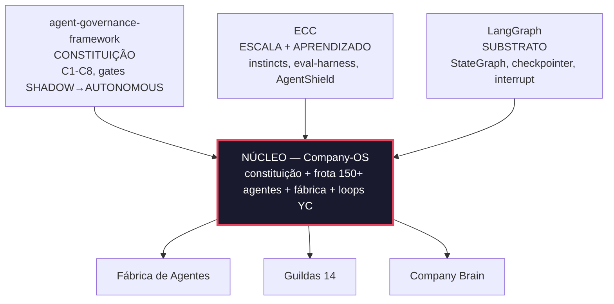

# Multi-Agent Company OS — reference framework

> Read this in [English](README.md).

> **O que é:** um framework de referência (codinome **NÚCLEO**) para orquestrar uma empresa inteira como frota de agentes — **~169 agentes em 14 guildas** (vendas, marketing, financeiro, suporte, engenharia, dados, segurança…), sobre **LangGraph**, com governança executável (C1–C8) e promoção por gates nos modos **SHADOW → PILOT → ASSISTED → AUTONOMOUS**: todo agente nasce observando (sugere, não age) e só ganha autonomia provando concordância em gates auditáveis.
> **Contexto:** o cenário de negócio usado nos documentos (venture "Orbita Labs", ICP, GTM) é **fictício** — serve de exemplo coerente para exercitar o framework. Nenhuma empresa, pessoa ou cliente real é referenciado.
> **Status:** protótipo funcional (kernel + fábrica + guildas-piloto + demos offline), v1 2026-05-29.

---

## O achado central de engenharia: never let a system grade its own homework

O resultado mais importante deste repositório não é a frota — é a medição de que **auto-avaliação mente em escala**:

- O avaliador interno (`run_evals`, casos gerados no mesmo pipeline que gera os agentes) aprovava **~100%** da frota.
- Um **juiz LLM externo e independente** (família de modelo distinta da geradora) aprovou **33%** dos mesmos agentes (N=24).
- Causa-raiz, visível no cache de artefatos: os agentes produziam **prosa-em-JSON que *descreve* a capacidade, não o artefato/código real** — e os eval-cases, autorados pelo mesmo processo, eram **tautológicos** (o `expected` era replay do próprio handler; num episódio, 270/270 casos passaram assim por todos os gates verdes).

A resposta virou a **arquitetura de verificação** do framework — independência estrutural, não disciplinar:

| Mecanismo | O que fecha | Onde |
|---|---|---|
| **Proveniência obrigatória** de todo eval-case (`catalog` / `human` / `independent`; `replay` proibido) | `expected` como eco do handler | [AGENTS.md](AGENTS.md) §0.4, `nucleo/quality/pre_pr_gate.py` |
| **Oráculo held-out** (VERIFY-IN-EVAL): critério que o agente nunca vê; veredito é função do artefato (ast/diff/sha), nunca booleano autodeclarado | agente que autora a própria prova | `nucleo/kernel/verification.py`, `tests/test_verify_*` |
| **Juiz externo de família distinta** com relatório de correlação interno×externo em CI | gate interno inflado | `nucleo/quality/judge_eval.py`, `.github/workflows/judge-correlation.yml` |
| **Anti-tautologia no red team**: um agente deliberadamente vulnerável TEM que reprovar | suíte de segurança decorativa | `nucleo/quality/` + `tests/test_redteam.py` |
| **Detector de homogeneidade de diff** (blocos de casos clonados) + **baseline que só encolhe** | "fechar métrica" com casos-clone | `nucleo/quality/diff_homogeneity.py`, `foundry_baseline.json` |
| **Separação autor × auditor**: quem gera o agente nunca gera o teste; o auditor nunca autora nem faz merge | o mesmo ator atestar a própria entrega | [AGENTS.md](AGENTS.md) §0.5, [docs/CONTRATO-NUCLEO-HERMES-ORACULO.md](docs/CONTRATO-NUCLEO-HERMES-ORACULO.md) |

> Detalhe do episódio e das decisões: [FABRICA-DE-AGENTES.md](FABRICA-DE-AGENTES.md) e [docs/PLANO-AJUSTE-ROTA.md](docs/PLANO-AJUSTE-ROTA.md).

---

## Tese em uma frase

> Não construímos 150 agentes à mão. Construímos um **Company-OS** (codinome **NÚCLEO**) que **fabrica, governa e evolui** uma frota de 150+ agentes — fundindo a **constituição governável do agent-governance-framework** (C1–C8, gates de promoção, economia, self-harness) com os **padrões de escala e aprendizado do ECC** (instincts, eval-harness, orquestração multi-agente), executados sobre o **runtime LangGraph** (grafos com estado, checkpoint, human-in-the-loop), operando segundo os **8 princípios da YC**.

---

## Documentos deste plano

| # | Documento | O que contém |
|---|---|---|
| 00 | **README.md** (este) | Tese, decisões-chave, resolução de tensões, roadmap-resumo |
| 01 | [01-AVALIACAO.md](01-AVALIACAO.md) | Avaliação do agent-governance-framework (forças/lacunas) + o que o ECC contribui + a fusão |
| 02 | [02-ARQUITETURA.md](02-ARQUITETURA.md) | Camadas do NÚCLEO, topologia LangGraph, mapa dos 8 princípios YC, modelo econômico, telemetria, loop de evolução |
| 03 | [03-CATALOGO-AGENTES.md](03-CATALOGO-AGENTES.md) | As 14 guildas, os ~169 agentes, e a anatomia (template) de cada agente (índice) |
| 04 | [04-IMPLEMENTACAO.md](04-IMPLEMENTACAO.md) | Esqueletos de código LangGraph (agente, supervisor, self-harness, gate), roadmap por fases até o MVP, riscos e mitigação |
| 05 | [05-DOUTRINA-GTM-LOVABLE.md](05-DOUTRINA-GTM-LOVABLE.md) | Doutrina de Growth & Cultura adaptada do teardown da Lovable; Constituição de Growth GR1–GR10; cadência operacional; north-star |
| 06 | [06-WORKSHOP-MERCADO.md](06-WORKSHOP-MERCADO.md) | Workshop facilitador-ready para definir o vertical (ancorado no ICP); pré-work com os próprios agentes, matriz de decisão, Market Decision Record e checklist do que desbloqueia |
| 📂 | [catalogo/](catalogo/) | **Detalhamento agente-a-agente** — o que CADA um dos ~169 agentes faz (1 arquivo por guilda G00–G14) + [mapa de handoffs](catalogo/00-MAPA-E-HANDOFFS.md) |
| 📂 | [workshop/](workshop/) | **Kit do workshop de mercado** — long-list-semente de candidatos + template de data-pack (insumos do [06](06-WORKSHOP-MERCADO.md)) |
| 🚀 | [DECK-CEO.md](DECK-CEO.md) · [nucleo/](nucleo/) | Deck da CEO + a **Sprint 0 rodando** (kernel + Fábrica + 6 agentes + 8 demos) |

---

## Referência de execução: o caso Lovable

A Lovable é a **prova viva** da tese AI-native da YC: de **0 a ~US$400M ARR em 14 meses com 146 PESSOAS** e quase zero mídia paga até US$300M ARR. O NÚCLEO leva isso ao limite seguinte: **onde a Lovable usou 146 pessoas, nós operamos com ~169 agentes + uma camada humana fina** (1 AI Founder + ~6 DRIs + ~4 ICs). Cada alavanca da Lovable (founder brand, beeswarming, freemium-como-marketing, "o agente É a ativação", ship diário, pricing outcome-based, marca como fosso, hire-for-slope, gate de *lovability*) fica **mais forte** quando executada por uma frota de agentes que nunca para de shippar.

> Isso vira a **Constituição de Growth (GR1–GR10)** — que complementa a Constituição técnica (C1–C8) e a doutrina YC (Y1–Y8). Detalhe e mapeamento alavanca→agente em **[05-DOUTRINA-GTM-LOVABLE.md](05-DOUTRINA-GTM-LOVABLE.md)**.

---

## As 7 decisões de arquitetura (resumo executivo)

1. **NÚCLEO governa, LangGraph executa, a Fábrica fabrica.** O agent-governance-framework é *build-time* (Markdown/Claude Code). Para 150 agentes *vivos*, portamos a constituição para um **runtime LangGraph** e construímos uma **Fábrica de Agentes** que materializa cada agente a partir de uma spec. Ninguém escreve 150 agentes na mão.

2. **Agentes nascem em SHADOW e "evoluem ganhando autonomia".** O ciclo C4 (`SHADOW → PILOT → ASSISTED → AUTONOMOUS`) **é** o mecanismo de evolução exigido pelo desafio: cada agente só ganha autonomia (e direito de "entregar" e "cobrar") ao provar concordância/qualidade em gates. Aprender = subir de confiança.

3. **Frota organizada em 13 guildas hierárquicas.** Cada guilda = um time hierárquico LangGraph (supervisor-agente + workers-agentes). Isso satisfaz YC #5 ("no human middleware": o supervisor é agente) e dá um caminho credível para 150+ sem caos. Detalhe em [03](03-CATALOGO-AGENTES.md).

4. **Toda ação emite um artefato para o Company Brain.** Um event store append-only + grafo/índice vetorial tornam a empresa **queryable** (YC #3). Dashboards, auditoria e o próprio aprendizado leem daí. É o "L0 de dados" da empresa.

5. **Aprendizado em duas velocidades.** *Rápido/automático*: instincts do ECC (auto-extração com confidence-score por sessão). *Lento/curado*: self-harness/Hermes (snapshot → PR de memória). `/evolve` promove instincts recorrentes a **skills compartilhadas** — é assim que a empresa inteira fica mais inteligente, não só um agente.

6. **Dois livros-razão econômicos resolvem a tensão "token-max × C3".** Veja abaixo — é a decisão econômica central.

7. **Humanos só nos nós de DRI/IC/founder.** A camada humana é fina e fixa; agentes fazem o roteamento. Gates de aprovação humana são implementados como `interrupt()` do LangGraph nos pontos C4. Os três arquétipos YC mapeiam para quem aprova o quê.

---

## A tensão central — "Token-max" (YC #7) × "Custo ≤ 25%" (C3 do foundry)

A YC manda **rodar uma conta de API desconfortavelmente alta** para substituir headcount. O agent-governance-framework manda **custo de operar ≤ 25% do preço cobrado** (C3, hard gate). Parecem se contradizer. **Não se contradizem — operam em livros-razão diferentes:**

| Livro-razão | O que é | Regra de governança | Comparação correta |
|---|---|---|---|
| **OPERATING (interno)** | Agentes fazendo o trabalho *da própria empresa* (engenharia, ops, growth, suporte interno) | **Token-max (YC #7)** — rode quente | Custo de tokens **vs. custo carregado do headcount que substitui**. Conta alta é vitória se o humano custaria 10×. |
| **BILLABLE (externo)** | Agentes cujo output é **vendido** ao cliente final | **C3 do foundry** — custo ≤ 25% do preço | Custo de inferência por outcome **vs. preço por outcome** |

> **Regra-mãe:** cada agente declara, na spec, a qual livro-razão pertence (`ledger: operating | billable`). O Unit-Economist (guarda C3) só **bloqueia promoção** de agentes `billable`. Agentes `operating` são governados por ROI-vs-headcount, não por C3. Isso preserva *as duas* doutrinas sem contradição.

---

## Roadmap-resumo (detalhe em [04](04-IMPLEMENTACAO.md))

| Fase | Janela | Entrega | Frota | Modo |
|---|---|---|---|---|
| **0 — Kernel** | Sem. 0–2 | Constituição-runtime, Company Brain, template de agente, self-harness wrapper, supervisor-raiz, telemetria, **a Fábrica** | ~5 | build |
| **1 — Agentes que fazem agentes** | Sem. 2–5 | Guildas de Governança, Engenharia, Qualidade, Segurança (a Fábrica humana→agêntica) | ~35 | SHADOW |
| **2 — Fabricação em massa** | Sem. 5–9 | Fábrica materializa guildas de negócio (Produto, Growth, Vendas, CustOps, Finanças, Dados…) a partir de specs | **150+** | SHADOW/PILOT |
| **3 — MVP** | Sem. 9–12 | Promoção dos agentes do caminho-crítico para ASSISTED/AUTONOMOUS via gates; eval-harness; hardening econômico; **launch** | 150+ | misto |
| **∞ — Evolução** | contínuo | Loops de aprendizado, auditoria mensal independente, `/evolve`, drift detection | cresce | autônomo |

---

## Como ler este plano

- **Executivo / banca do desafio:** este README + o mapa dos 8 princípios YC em [02](02-ARQUITETURA.md).
- **Arquiteto/tech lead:** [02](02-ARQUITETURA.md) → [04](04-IMPLEMENTACAO.md) (código).
- **Quem vai construir os agentes:** [03](03-CATALOGO-AGENTES.md) (catálogo + anatomia) → [04](04-IMPLEMENTACAO.md) (esqueletos).

## Licença

Copyright (c) 2026 Rafael Novaes.

Licenciado sob [PolyForm Noncommercial License 1.0.0](./LICENSE.md) — leitura, estudo e uso não comercial permitidos; uso comercial requer autorização expressa do autor.
